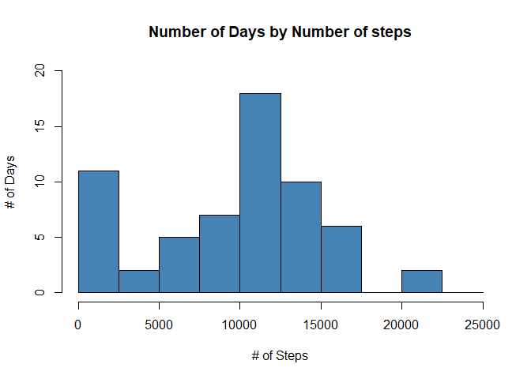
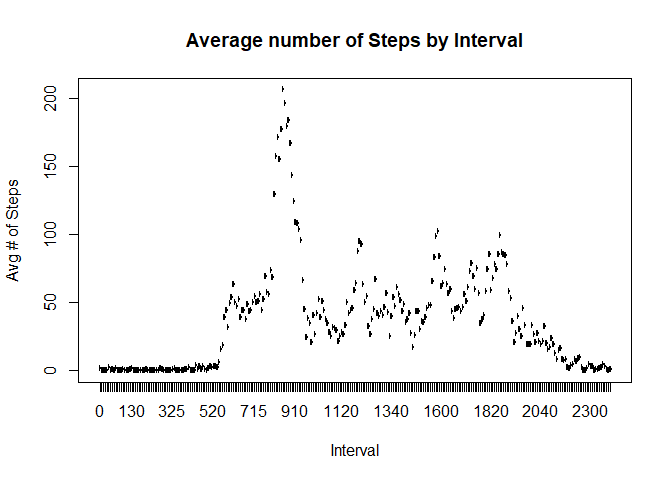
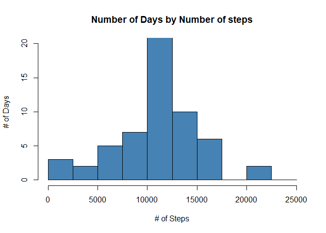
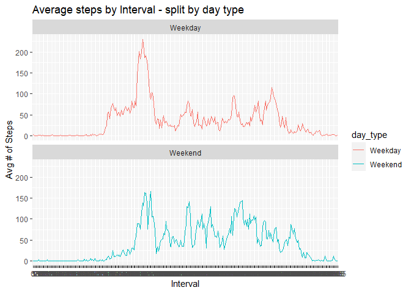

<br />  <!-- Adding a new line -->  

## Introduction

Coursera - Reproducible Research - Week 2 - Peer Graded Assignment Report.

Study analyzes human activity.

<br />  <!-- Adding a new line --> 

## Import data


```r
if (!file.exists("./activity.csv")) {

  # Download data file
  file_url <- "https://d396qusza40orc.cloudfront.net/repdata%2Fdata%2Factivity.zip"
  file_name <- "activity.zip"

  download.file(file_url, file_name, method = "curl")


  # unzip file
  unzip(file_name)

} 
```

<br />  <!-- Adding a new line -->  

Read base data into 'z_Data_All'.


```r
z_Data_All <- read.csv("./activity.csv", header = TRUE)
head(z_Data_All)
```

```
##   steps       date interval
## 1    NA 2012-10-01        0
## 2    NA 2012-10-01        5
## 3    NA 2012-10-01       10
## 4    NA 2012-10-01       15
## 5    NA 2012-10-01       20
## 6    NA 2012-10-01       25
```

```r
str(z_Data_All)
```

```
## 'data.frame':	17568 obs. of  3 variables:
##  $ steps   : int  NA NA NA NA NA NA NA NA NA NA ...
##  $ date    : chr  "2012-10-01" "2012-10-01" "2012-10-01" "2012-10-01" ...
##  $ interval: int  0 5 10 15 20 25 30 35 40 45 ...
```

<br />  <!-- Adding a new line -->

Convert data types -


```r
d_Activity_Data <- z_Data_All

d_Activity_Data$date <- as.Date(d_Activity_Data$date)
d_Activity_Data$interval <- as.factor(d_Activity_Data$interval)

str(d_Activity_Data)
```

```
## 'data.frame':	17568 obs. of  3 variables:
##  $ steps   : int  NA NA NA NA NA NA NA NA NA NA ...
##  $ date    : Date, format: "2012-10-01" "2012-10-01" ...
##  $ interval: Factor w/ 288 levels "0","5","10","15",..: 1 2 3 4 5 6 7 8 9 10 ...
```

<br />  <!-- Adding a new line -->

# Assignment tasks -

<br />  <!-- Adding a new line -->

## Task 1: What is mean total number of steps taken per day?
For this part of the assignment, you can ignore the missing values in the dataset.  

1. Calculate the total number of steps taken per day
2. Make a histogram of the total number of steps taken each day
3. Calculate and report the mean and median of the total number of steps taken per day


```r
## Total number of steps taken per day
d_Steps_Per_Day <- aggregate(
  d_Activity_Data$steps,
  by = list(d_Activity_Data$date),
  FUN = sum,
  na.rm = TRUE
)

names(d_Steps_Per_Day) <- c("date", "total_steps")

head(d_Steps_Per_Day)
```

```
##         date total_steps
## 1 2012-10-01           0
## 2 2012-10-02         126
## 3 2012-10-03       11352
## 4 2012-10-04       12116
## 5 2012-10-05       13294
## 6 2012-10-06       15420
```


```r
## Histogram of total number of steps taken each day

hist(d_Steps_Per_Day$total_steps,
     main = "Number of Days by Number of steps",
     ylim = c(0, 20),
     xlab = "# of Steps",
     ylab = "# of Days",
     breaks = seq(0, 25000, by = 2500),
     col = "steelblue"
     )
```

<!-- -->

```r
s_Mean_Steps_Per_Day <- format(round(mean(d_Steps_Per_Day$total_steps)), big.mark = ",")
s_Median_Steps_Per_Day <- format(round(median(d_Steps_Per_Day$total_steps)), big.mark = ",")
```

Average number of total steps per day = 9,354.
<br />  <!-- Adding a new line -->

Median number of total steps per day = 10,395.
<br />  <!-- Adding a new line -->

## Task 2: What is the average daily activity pattern?
For this part of the assignment, you can ignore the missing values in the dataset.  

1. Make a time series plot (i.e. type = "l") of the 5-minute interval (x-axis) and the average number of steps taken, averaged across all days (y-axis)
2. Which 5-minute interval, on average across all the days in the dataset, contains the maximum number of steps?


```r
## Average number of steps taken per interval
d_Avg_Steps_Per_Interval <- aggregate(
  d_Activity_Data$steps,
  by = list(d_Activity_Data$interval),
  FUN = mean,
  na.rm = TRUE
)

names(d_Avg_Steps_Per_Interval) <- c("interval", "avg_steps")

## Plot - Avg steps vs. Interval
plot(d_Avg_Steps_Per_Interval$interval,
     d_Avg_Steps_Per_Interval$avg_steps,
     type = "l",
     col = "steelblue",
     lwd = 2,
     xlab = "Interval",
     ylab = "Avg # of Steps",
     main = "Average number of Steps by Interval"
     )
```

<!-- -->

Averagely across days, highest number of steps are observed during interval 835.


## Task 3: Imputing missing values
For this part of the assignment, you can ignore the missing values in the dataset.  

1. Calculate and report the total number of missing values in the dataset (i.e. the total number of rows with NAs)
2. Devise a strategy for filling in all of the missing values in the dataset. The strategy does not need to be sophisticated. For example, you could use the mean/median for that day, or the mean for that 5-minute interval, etc.
3. Create a new dataset that is equal to the original dataset but with the missing data treated appropriately.
4. Make a histogram of the total number of steps taken each day and calculate and report the mean and median total number of steps taken per day. Do these values differ from the estimates from the first part of the assignment? What is the impact of imputing missing data on the estimates of the total daily number of steps?


```r
## Number of missing values (rows)
sum(is.na(d_Activity_Data$steps))
```

```
## [1] 2304
```

Missing values will be replaced by avearge number of steps observed during intervals across days (ignoring the missing values).


```r
## Number of missing values (rows)
d_Activity_Data_v2 <- merge(
  x = d_Activity_Data,
  y = d_Avg_Steps_Per_Interval,
  by.x = "interval",
  by.y = "interval"
)

d_Activity_Data_v2 <- d_Activity_Data_v2[order(d_Activity_Data_v2$date, d_Activity_Data_v2$interval), ]
rownames(d_Activity_Data_v2) <- 1:nrow(d_Activity_Data_v2)

head(d_Activity_Data_v2)
```

```
##   interval steps       date avg_steps
## 1        0    NA 2012-10-01 1.7169811
## 2        5    NA 2012-10-01 0.3396226
## 3       10    NA 2012-10-01 0.1320755
## 4       15    NA 2012-10-01 0.1509434
## 5       20    NA 2012-10-01 0.0754717
## 6       25    NA 2012-10-01 2.0943396
```

```r
## Replace missing steps for intervals with averages across days
d_Activity_Data_v2$steps_v2 <- ifelse(
  is.na(d_Activity_Data_v2$steps),
  d_Activity_Data_v2$avg_steps,
  d_Activity_Data_v2$steps
)

head(d_Activity_Data_v2)
```

```
##   interval steps       date avg_steps  steps_v2
## 1        0    NA 2012-10-01 1.7169811 1.7169811
## 2        5    NA 2012-10-01 0.3396226 0.3396226
## 3       10    NA 2012-10-01 0.1320755 0.1320755
## 4       15    NA 2012-10-01 0.1509434 0.1509434
## 5       20    NA 2012-10-01 0.0754717 0.0754717
## 6       25    NA 2012-10-01 2.0943396 2.0943396
```


```r
library(scales)

## Total number of steps taken per day with missing value treatment
d_Steps_Per_Day_v2 <- aggregate(
  d_Activity_Data_v2$steps_v2,
  by = list(d_Activity_Data_v2$date),
  FUN = sum,
  na.rm = TRUE
)

names(d_Steps_Per_Day_v2) <- c("date", "total_steps")


## Histogram of total number of steps taken each day with missing value treatment
hist(d_Steps_Per_Day_v2$total_steps,
     main = "Number of Days by Number of steps",
     ylim = c(0, 20),
     xlab = "# of Steps",
     ylab = "# of Days",
     breaks = seq(0, 25000, by = 2500),
     col = "steelblue"
     )
```

<!-- -->

```r
## Calculate stats
s_Mean_Steps_Per_Day_v2 <- format(round(mean(d_Steps_Per_Day_v2$total_steps)), big.mark = ",")
s_Median_Steps_Per_Day_v2 <- format(round(median(d_Steps_Per_Day_v2$total_steps)), big.mark = ",")

## Calculate difference - with vs without missing value treatment
s_Diff_Mean <- percent((mean(d_Steps_Per_Day_v2$total_steps)/mean(d_Steps_Per_Day$total_steps)) - 1)
s_Diff_Median <- percent((median(d_Steps_Per_Day_v2$total_steps)/median(d_Steps_Per_Day$total_steps)) - 1)
```

Post missing value treatment,

* Average number of total steps per day = 10,766 - this is increased by 15% when compared with the dataset that ignored the missing values.
* Median number of total steps per day = 10,766 - this is increased by 4% when compared with the dataset that ignored the missing values.


## Task 4: Are there differences in activity patterns between weekdays and weekends?
Use the dataset with the filled-in missing values for this part.

1. Create a new factor variable in the dataset with two levels – “weekday” and “weekend” indicating whether a given date is a weekday or weekend day
2. Make a panel plot containing a time series plot (i.e. type = "l") of the 5-minute interval (x-axis) and the average number of steps taken, averaged across all weekday days or weekend days (y-axis)


```r
library(timeDate)
library(ggplot2)

## Add flag weekday / weekend against all dates
d_Activity_Data_v2$day_type <- as.factor(ifelse(isWeekday(d_Activity_Data_v2$date, wday = 1:5), "Weekday", "Weekend"))

str(d_Activity_Data_v2)
```

```
## 'data.frame':	17568 obs. of  6 variables:
##  $ interval : Factor w/ 288 levels "0","5","10","15",..: 1 2 3 4 5 6 7 8 9 10 ...
##  $ steps    : int  NA NA NA NA NA NA NA NA NA NA ...
##  $ date     : Date, format: "2012-10-01" "2012-10-01" ...
##  $ avg_steps: num  1.717 0.3396 0.1321 0.1509 0.0755 ...
##  $ steps_v2 : num  1.717 0.3396 0.1321 0.1509 0.0755 ...
##  $ day_type : Factor w/ 2 levels "Weekday","Weekend": 1 1 1 1 1 1 1 1 1 1 ...
```

```r
## Aggregate average number of steps (missing value treated) at interval - day type level
d_Avg_Steps_Per_Interval_Day_Type_v2 <- aggregate(
  d_Activity_Data_v2$steps_v2,
  by = list(d_Activity_Data_v2$interval, d_Activity_Data_v2$day_type),
  FUN = mean,
  na.rm = TRUE
)

names(d_Avg_Steps_Per_Interval_Day_Type_v2) <- c("interval", "day_type", "avg_steps")

head(d_Avg_Steps_Per_Interval_Day_Type_v2)
```

```
##   interval day_type  avg_steps
## 1        0  Weekday 2.25115304
## 2        5  Weekday 0.44528302
## 3       10  Weekday 0.17316562
## 4       15  Weekday 0.19790356
## 5       20  Weekday 0.09895178
## 6       25  Weekday 1.59035639
```

```r
## Plot average steps by interval split by day_type
plot_01 <- ggplot(d_Avg_Steps_Per_Interval_Day_Type_v2, aes(x = interval, y = avg_steps, color = day_type, group = day_type)) +
           geom_line() +
           labs(title = "Average steps by Interval - split by day type", x = "Interval", y = "Avg # of Steps") +
           facet_wrap(~day_type, ncol = 1, nrow = 2)

print(plot_01)
```

<!-- -->


